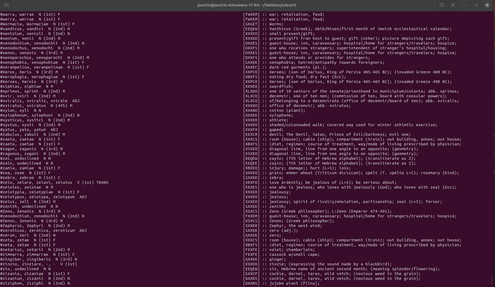

### cdewrd

Codeword, stylized cdewrd or c\_de w\_rd was inspired by my love of word games and the recent wordle craze. Given my experience working with the romance languages, I thought it would be fun to try solving puzzles using latin words. This is currently a work in progress.

I started by sourcing a list of latin words. Finding a list was not difficult, however finding a list that I could easily work with proved harder than I expected. I ultimately happened upon an archived university project and downloaded the RAW file used as the data for a command line based interactive latin dictionary. The following image is an example of the data formatting.

</img>

Clearly I had to do some work on the file to get lists of just words. I created two scripts to run in the terminal, one which read the RAW data and converted it into lists of words separated by lengths, and another to remove any duplicate words and proper nouns. The results of the prior script can be seen below.

 </img>

I had a couple of ideas about how exactly to remove the duplicates. My first thought was to use filter and check each word against a new list for duplicates. That ends up being O(n^2), which is pretty inefficient. I then thought of sorting the lists first, and remembered that the lists are already in alphabetical order. It occurred to me that all I really had to check is that the previous word isn't the same as the current word when adding to the new list. This ended up being more efficient since there are only a couple operations per word rather than a few thousand.

Now I need to work on the database schema. I want to use separate tables for each list, named for the length, and a foreign key relationship between these tables and the user. Each user would have their own list of completed words and a list of every word guessed for each word. 